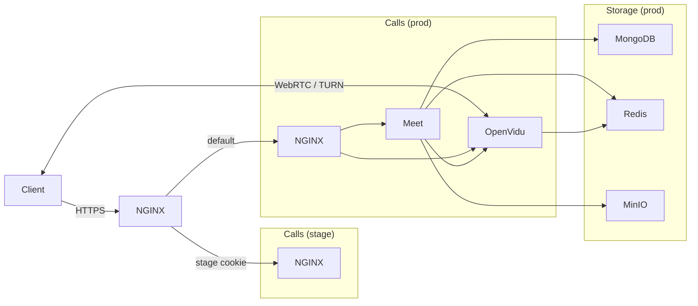

  
  powered by <a href="https://github.com/dmironenko/composer">composer</a>

# Deployer

Инфраструктура сервиса плагинов для OpenVidu

## Архитектура

```mermaid
flowchart LR
  browser[Client] -->|HTTPS| ingress[NGINX]
  ingress -->|default| proxy
  ingress -->|stage cookie| stage
  browser <-->|WebRTC / TURN| openvidu

  subgraph calls_stage["Calls (stage)"]
    stage[NGINX]
  end

  subgraph calls_prod["Calls (prod)"]
    proxy["NGINX"] --> meet[Meet]
    proxy --> openvidu[OpenVidu]
    meet --> openvidu
  end

  subgraph storage["Storage (prod)"]
    mongodb[MongoDB]
    redis[Redis]
    minio[MinIO]
  end

  meet --> mongodb
  meet --> redis
  meet --> minio
  openvidu --> redis
```
